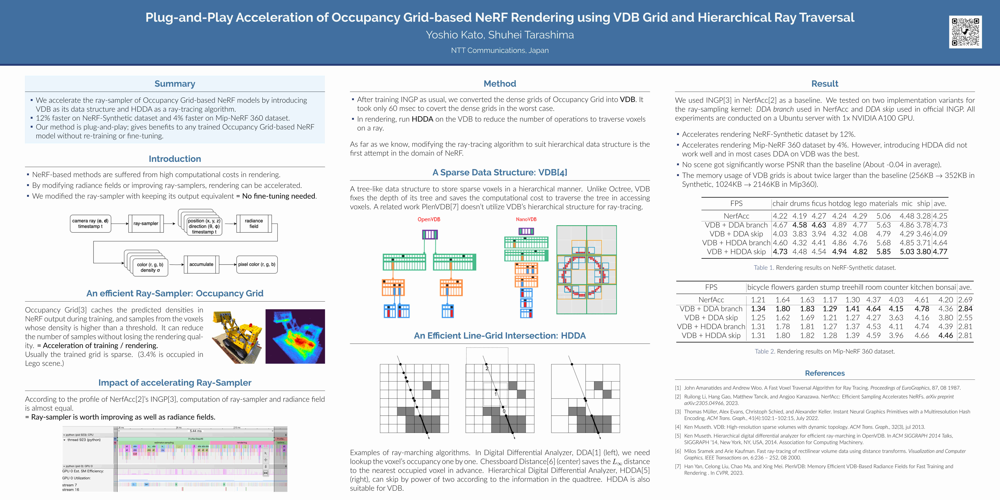

Source code for ["Plug-and-Play Acceleration of Occupancy Grid-based NeRF Rendering using VDB Grid and Hierarchical Ray Traversal"](https://arxiv.org/abs/2404.10272)



## Usage

```
> docker build -t faster-occgrid .
> bash start_container.sh
# pip install -e ./nerfacc
# cd experiments
# bash ./run_baselines.sh
```

```
( Edit experiments/vdbgrid/csrc/grid_kernel.cu and comment/uncomment #define ALG_* )
# pip install -e ./experiments/vdbgrid
# mkdir {EXPNAME}
# bash ./run_experiments.sh {EXP_NAME}
```

## LICENSE
This repository is licensed under MIT License. See ./LICENSE for detail.

### License of NerfAcc
Some codes are copied from https://github.com/nerfstudio-project/nerfacc.git

```
MIT License

Copyright (c) 2022 Ruilong Li

Permission is hereby granted, free of charge, to any person obtaining a copy
of this software and associated documentation files (the "Software"), to deal
in the Software without restriction, including without limitation the rights
to use, copy, modify, merge, publish, distribute, sublicense, and/or sell
copies of the Software, and to permit persons to whom the Software is
furnished to do so, subject to the following conditions:

The above copyright notice and this permission notice shall be included in all
copies or substantial portions of the Software.

THE SOFTWARE IS PROVIDED "AS IS", WITHOUT WARRANTY OF ANY KIND, EXPRESS OR
IMPLIED, INCLUDING BUT NOT LIMITED TO THE WARRANTIES OF MERCHANTABILITY,
FITNESS FOR A PARTICULAR PURPOSE AND NONINFRINGEMENT. IN NO EVENT SHALL THE
AUTHORS OR COPYRIGHT HOLDERS BE LIABLE FOR ANY CLAIM, DAMAGES OR OTHER
LIABILITY, WHETHER IN AN ACTION OF CONTRACT, TORT OR OTHERWISE, ARISING FROM,
OUT OF OR IN CONNECTION WITH THE SOFTWARE OR THE USE OR OTHER DEALINGS IN THE
SOFTWARE.

THIS SOFTWARE AND/OR DATA WAS DEPOSITED IN THE BAIR OPEN RESEARCH COMMONS 
REPOSITORY ON 05/08/2023.
```

## Citation

```
@misc{kato2024plugandplay,
      title={Plug-and-Play Acceleration of Occupancy Grid-based NeRF Rendering using VDB Grid and Hierarchical Ray Traversal}, 
      author={Yoshio Kato and Shuhei Tarashima},
      year={2024},
      eprint={2404.10272},
      archivePrefix={arXiv}
}
```
